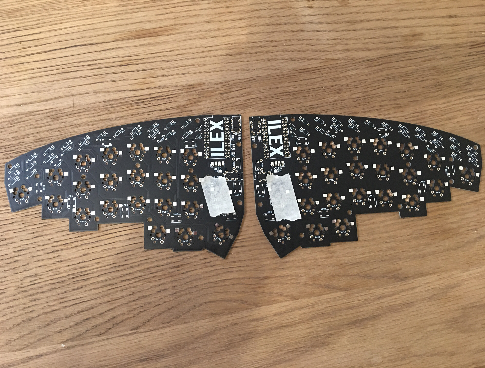

# Ilex Build Guide

## Required Parts

The required parts listed below are for a complete Ilex set (both halves). 

### Required

| Name            | Quantity     |
|-----------------|--------------|
| PCB             | 2            |
| Diodes          | 44           |
| TRRS Jack       | 2            |
| Tactile Switch  | 2            |
| Pro Micro  / Elite-C     | 2 total, or 1 of each          |
| Plate Top       | 2            |
| Plate Bottom    | 2            |
| Acrylic Guard   | 2            |
| 3.5mm Aux Cable | 1            |
| USB Cable       | 1            |

### Optional

| Name            | Quantity     |
|-----------------|--------------|
| OLED Module     | 2 for both sides, 1 for a single side           |
| Rotary Encoders | 2 for both sides, 1 for a single side           |
| WS2821B LED's   | 20           | 

## Getting Started

Assuming you have all of the required parts and however many of the optional parts, we can now begin the process of building your Ilex. The PCB's are reversible, which means that they can be used as either the left or the right side for your keyboard, so you must select which half will be the left-side, and which will be the right-side. Mark each of these by placing a small strip of masking tape on each piece on the top side, as this will help to differentiate which is which during the build process. An example of this can be seen below:

## Diodes

To begin the build, we will solder the diodes to the top side of the PCB's (the side you marked with masking tape). It is important to note that the orientation that the diodes are placed is extremely important, so take care to place these correctly. On the PCB is a line for the cathode end of the diode, which is represented with a line on the diode. Make sure both of these lines are on the same side, seen below:

> Diode orientation Pic

Before soldering any diodes, it is highly recommended to first place them into the PCB and then double check they are oriented correctly. This can be done by bending the legs on the bottom side to keep the diodes in place:

>> Diode Soldering Steps

## TRRS Jack and Reset Switch

Ilex has two positions that you can use for the TRRS jack, either to the side of the pro-micro, or to the south of the pro-micro - the image below outlines these two positions. 

Only one will need to be soldered per side of the PCB, two total. Depending on what way you would like your connecting aux cable to be orientated will depend on which TRRS jacks you decide to use. For the purpose of this guide I will use the vertical facing orientation, however feel free to use the horizontal orientation instead.

Before soldering the TRRS jack in place, it is highly recommended to fix it to the PCB with a small piece of masking tape. This will help ensure that the TRRS jack stays in place during soldering. Make sure not to cover the pins on the bottom of the PCB.

Once you have selected where your TRRS jack will be soldered, you first will need to bridge the jumper terminals located nearby. If you selected the location at the top of the board you will need to solder the pads `Rn and Rn2`, and if you selected the location below the pro-micro you will need to solder `Rn3 and Rn4`. Do this on the top of the board (the side with masking tape). Ensure that the solder does not flow into any connectors. 

The Reset switch can only be installed in one location, on the edge of the board between the two TRRS jack locations, which can be seen below:

Once the locations of both the TRRS jack and the reset switch have been selected, double check to make sure the TRRS jack has been secured with masking tape. The reset switch does not require this extra step as it will 'click' into place. Turn over the board and solder the pins from the bottom, making sure to keep the TRRS jack and reset switch in firm contact with the board.

> Image of soldered TRRS and Reset Switch

## Pro Micro / Elite-C

Before installing the pro-micro, check whether it is working by plugging each in and flashing the default kepmap to it. 

The Pro Micro's will come with a standard header, however if you have purchased the mill-max socket header it will make it easier to replace the unit in future if required. 

Take note of the outlined holes on the PCB. The Pro Micro is installed within the white frame on that side of the PCB, seen below:

> Pro Micro White Frame Pic

## OLED (Optional)
Installing an OLED is entirely optional for this build. If you do intend to add an OLED to your build then the jumper terminals must be bridged.

## Testing before continuing

It is highly recommend to stop at this point and test that everything is working correctly. Desoldering components is not as easy as installing them.

First, assuming that you have flashed the Pro Micro

## Underglow LED's (Optional)

Next we will solder the LED's to the positions marked on the bottom side of the board (The side without masking tape). Pay close attention to the orientation of the LED's, and be try not to touch the LED itself with the soldering iron. 

The LED's are soldered in a series, so if one has a bad connection or has broken the rest of the series will not light up. 

## Hotswap sockets (Optional)

If you are intending on making your Ilex hotswappable, then follow this step. Otherwise feel free to skip ahead.

You can use either Kailh hotswap sockets which can be purchased at the same time as the Ilex on FFKeebs, or millmax sockets can be used. For the purpose of this guide I will discuss kailh sockets, and assume if you have purchased millmax soclets that you know how to use them. However, both are compatible.

The sockets are to be soldered on the bottom side of the PCB (the side without the masking tape). 

